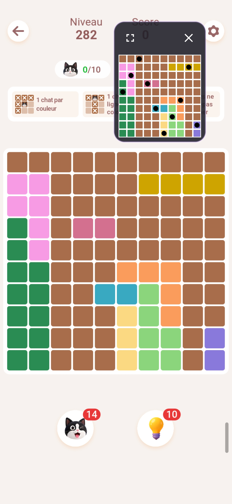

# Meowdoku Solver

Outil de résolution automatique du jeu de grille [Meowdoku](https://play.google.com/store/apps/details?id=com.oakever.meowdoku). Disponible en tant qu'application web (navigateur) et application Android native.

## Principe

Le solver analyse une capture d'écran du jeu et résout la grille en respectant les règles :

- **Un symbole par couleur** — chaque couleur contient exactement un symbole
- **Un symbole par ligne et colonne** — comme un sudoku classique
- **Pas de symboles adjacents** — aucun symbole ne peut toucher un autre (8-directionnel)

## Comment ça marche

1. **Détection** — L'image est analysée pour localiser la grille, identifier les lignes/colonnes de contour, puis associer à chaque case sa couleur (via clustering CIELAB / Delta E)
2. **Résolution** — Un solveur CSP (backtracking ligne par ligne) place un symbole par ligne en respectant les contraintes colonne, couleur et voisinage
3. **Rendu** — La solution est superposée sur l'image originale, avec des étoiles (★) aux positions des symboles (app web) ou des disques noirs (app Android)

## Application Web

Fichier d'entrée : `index.html`

Ouvrir dans un navigateur, puis :

- Glisser-déposer ou charger un fichier `.jpg` (capture du jeu)
- La grille est automatiquement détectée et affichée
- Cliquer **Résoudre** pour calculer la solution
- Cliquer **Export JSON** pour télécharger la grille au format JSON (utile pour les tests)

### Structure

```
js/
  color.js      — Conversions couleur RGB ↔ CIELAB, Delta E 76
  detector.js   — Détection de grille dans l'image (contours, couleurs, symboles)
  solver.js     — Solveur CSP par backtracking
  main.js       — Interface utilisateur (drag/drop, affichage, édition)
style.css       — Styles
```

## Application Android

Répertoire : `android-app/`

Application Kotlin native (pas de WebView). Compatible Android API 26+.



### Fonctionnement

Deux façons d'obtenir la solution :

1. **Par partage** : l'utilisateur partage une capture d'écran vers l'app Meowdoku Solver (via le menu de partage Android)
2. **Par capture d'écran directe** : depuis l'écran d'accueil, toucher **Afficher l'overlay**, puis dans le jeu toucher le bouton 📷 de l'overlay. Un consentement `MediaProjection` est demandé la première fois, puis la grille est capturée et résolue sans quitter le jeu

Dans les deux cas, une notification avec vignette de la solution apparaît, et la solution s'affiche en **superposition** (overlay) par-dessus le jeu, grâce au `OverlayService`.

Depuis l'overlay :

- **Capture** (📷) — capture l'écran du jeu et met à jour la solution. Pendant l'analyse, l'image se grise avec le texte « Analyse en cours… » ; en cas d'échec elle reste grisée (« Échec de l'analyse — re-touchez 📷 »)
- **Fermer** (×) et **déplacer** (drag)
- **Plein écran** (bouton en haut à gauche) — masque l'overlay pour consulter la solution en grand ; un bouton permet de revenir en overlay
- L'overlay peut être ouvert sans image (texte « Prêt à capturer » au centre) ; la hauteur ne varie pas selon les messages

### Structures de capture

La capture d'écran utilise `CaptureService` (foreground service type `mediaProjection`) :

- `CaptureConsentActivity` demande le consentement `MediaProjection` (lancée dans une tâche vierge pour ne pas découvrir l'écran d'accueil)
- Une seule `VirtualDisplay` persistante (`AUTO_MIRROR`) est créée : Android 14+ interdit d'en créer plusieurs avec la même projection
- Un `ImageReader` conserve en continu la dernière frame (`lastFrame`), ce qui évite les captures vides lorsque des frames sont consommées entre l'acquisition et la lecture
- `SolutionProcessor` factorise le pipeline commun : redimensionnement à 1080px → détection → résolution → rendu → sauvegarde

### Structure

```
app/src/main/java/com/meowdoku/solver/
  MeowdokuApp.kt              — Application, canal de notification
  detector/
    ColorUtils.kt              — CIELAB, Delta E 76, comparaison de couleurs
    Grid.kt                    — Data classes (Cell, DetectedGrid, Symbol, BoundingBox)
    GridDetector.kt            — Détection de grille (port fidèle de detector.js)
  solver/
    GridSolver.kt              — Solveur CSP backtracking (port fidèle de solver.js)
    SolutionProcessor.kt       — Pipeline commun détection → résolution → rendu → sauvegarde
  service/
    SolveService.kt            — ForegroundService dédié au partage d'image
    CaptureService.kt          — Capture d'écran MediaProjection (VirtualDisplay persistante)
    OverlayService.kt          — Overlay flottant (chat head) : capture, fermeture, drag, plein écran
  ui/
    MainActivity.kt            — Écran d'accueil (bouton « Afficher l'overlay »)
    ShareReceiverActivity.kt   — Réception du partage d'image
    CaptureConsentActivity.kt  — Consentement MediaProjection
    SolutionActivity.kt        — Affichage plein écran de la solution
    GridRenderer.kt            — Rendu de la solution sur Bitmap
  notification/
    NotificationHelper.kt      — Notifications système (analyse, solution, erreur)
```

### Construction

```bash
cd android-app
./gradlew assembleDebug
```

L'APK de debug est généré dans `app/build/outputs/apk/debug/`.

### Prérequis

- JDK 17
- Android SDK (API 34)
- Gradle 8.14 (wrapper inclus)

### Permissions

- `POST_NOTIFICATIONS` — afficher la notification de solution
- `FOREGROUND_SERVICE` / `FOREGROUND_SERVICE_MEDIA_PROJECTION` — maintenir le calcul et la capture d'écran actifs en arrière-plan
- `SYSTEM_ALERT_WINDOW` — afficher l'overlay de solution par-dessus les autres applications
- `MediaProjection` (consentement par session, demandé au premier clic sur 📷)

## Tests

### Tests JVM (Kotlin)

```bash
cd android-app
./gradlew testDebugUnitTest
```

- `DetectorTest` — vérifie la détection sur les samples de référence (10x10 et 12x12)
- `SolverRegressionTest` — vérifie la résolution sur une grille 9x9 de référence

### Tests JS (Deno)

```bash
deno run --allow-read tests/deno_test.js   # pipeline complet détection + résolution (10x10)
deno run --allow-read tests/test_12x12.js  # détection sur le sample 12x12
deno run --allow-read tests/test_solver_json.js  # résolution sur une grille 9x9
```

## Jeu de test

Le répertoire `Samples/` contient des captures d'écran et des grilles JSON exportées depuis l'app web. Le format JSON :

```json
{
  "size": 9,
  "cells": [[{"color": 1}, ...], ...],
  "colorMap": ["#8979da", ...],
  "detectedSymbols": [{"row": 6, "col": 1, "color": 8}, ...]
}
```

## Détails techniques

### Détection des couleurs

Les cases sont identifiées par leur couleur de fond (pixel en `(xLeft+8, yTop+8)` pour éviter les coins arrondis et les contours). Le clustering utilise l'espace CIELAB avec une distance Delta E 76 < 3 pour regrouper les nuances proches (tolérance aux artefacts JPEG).

### Résolution

Le solver explore les lignes une par une (backtracking). Pour chaque ligne, il essaie chaque colonne libre en vérifiant :

- La colonne n'est pas déjà utilisée
- La couleur n'est pas déjà utilisée
- Aucun symbole adjacent (8-voisinage)

L'heuristique MRV (Most Values Remaining) trie les lignes par nombre de candidats décroissant pour accélérer l'exploration.

Réalisé avec l'aide d'OpenCode et BigPickle.
